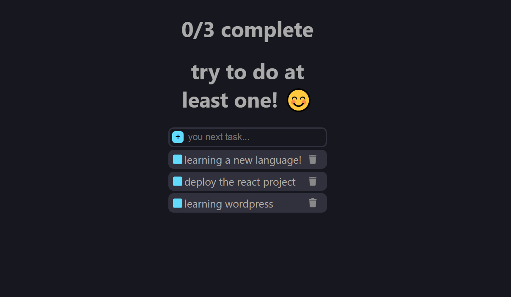
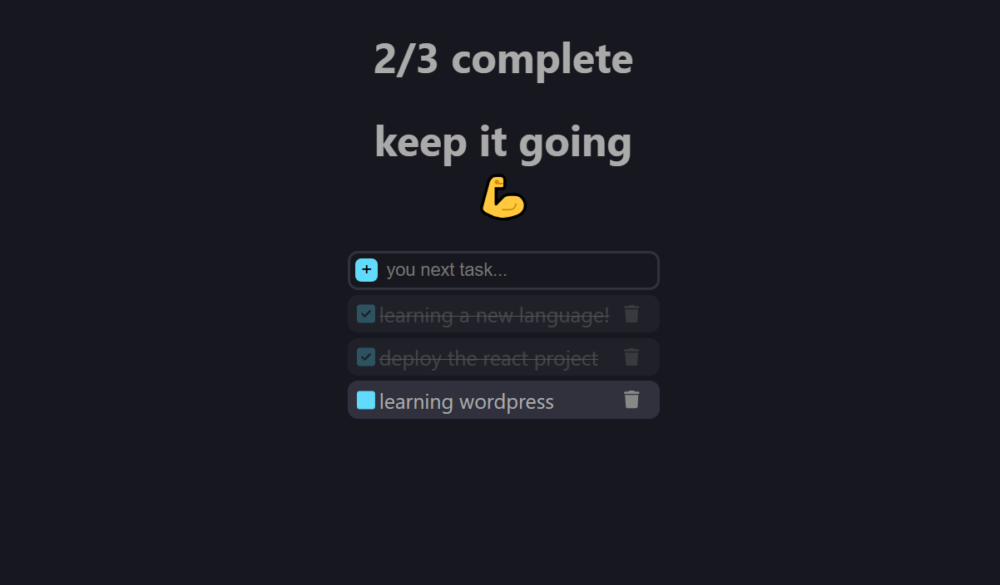
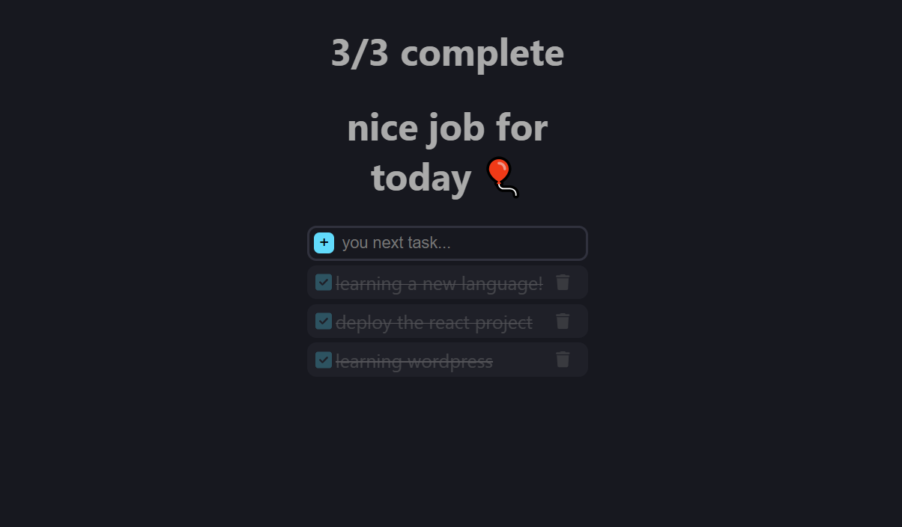

# Todo App

A user-friendly Todo App built with React. Add, edit, delete, and track your tasks with a motivational touch.

## 📝 Features

- ✅ Add new tasks
- 🖊️ Edit existing tasks
- ❌ Delete tasks
- 💾 Data saved in **Local Storage**
- 🔁 Tasks remain after refresh
- 🔔 Notifications:
  - If no tasks are completed: "Make at least one"
  - If some tasks are done: "Keep going"
  - If all tasks are done: "Nice job for today!"

## 🚀 How to Run

1. Clone the repo:

   ```bash
   git clone https://github.com/luaiadhmani/todo-app.git
   ```

2. Install dependencies:
   npm install

3. Start the app:
   npm start

🛠 Tech Stack:

React: Front-end framework
JavaScript: Programming language
CSS: Styling
LocalStorage: To persist tasks across sessions

🖼️ Screenshots:






